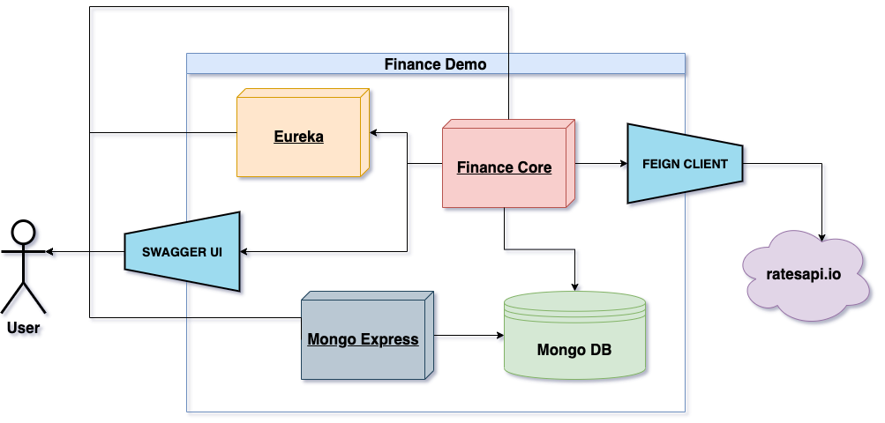
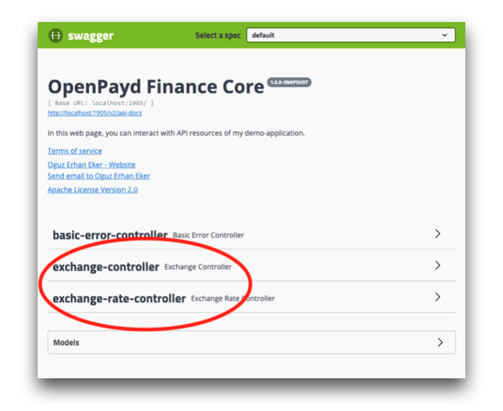
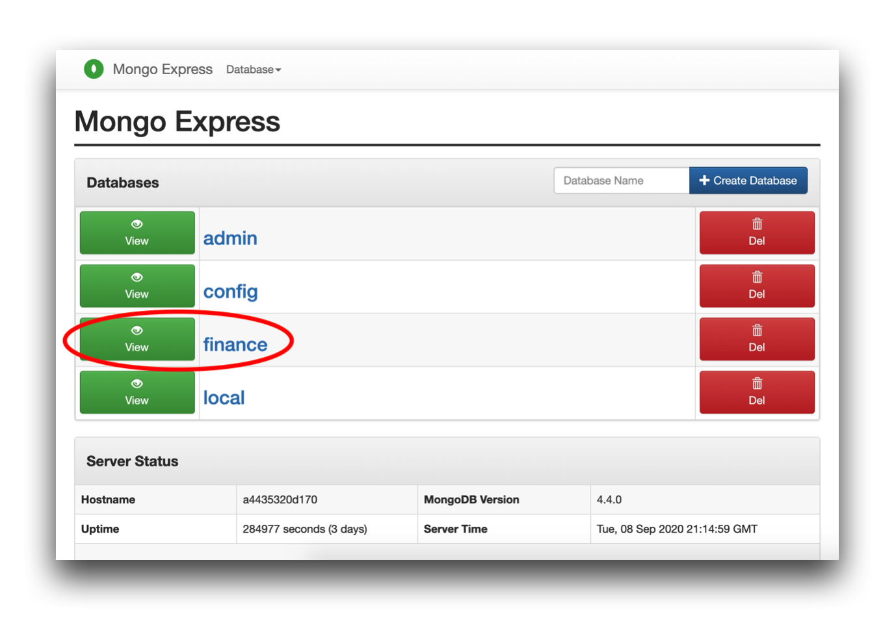
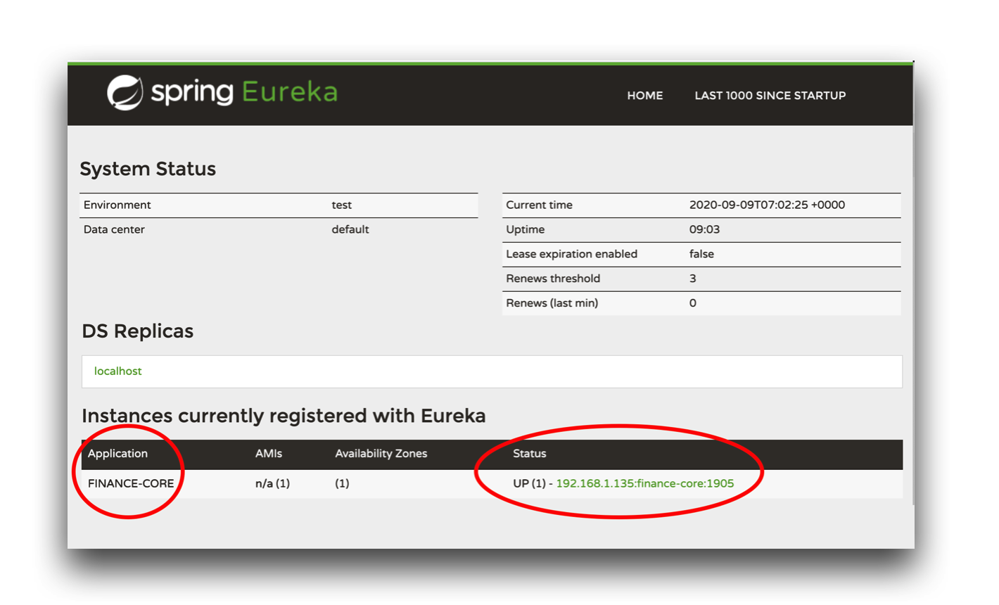

= Reference Documentation for Finance Demo Project
:doctype: book
:icons: font
:source-highlighter: highlightjs
:toc: left
:toclevels: 4
:sectlinks:

== Summary

Finance Demo Application is implemented to retrieve currency exchange rates, create currency conversions and list currency conversions. `*ratesapi.io*` rate service provider is used for retrieving currency exchange rates.

== Modules

Finance Demo application comprises of three main components:

- `Finance-Core`
- `MongoDB`
- `Eureka Service Registry`

Interconnections between components and subcomponents are displayed in the diagram above.

=== Finance-Core

This is the main unit of business logic inside the application.

==== Rest API Resources

This application is `*Swagger UI*` enabled. Please make sure to visit `*http://$HOSTNAME:1905/swagger-ui.html*` for API reference. On this screen, you can directly interact with `*REST API*` resources of the demo application.

==== Business Errors

We provide a central error logging mechanism for the application. This way, some generic errors could be mapped to more specific ones for better adherence and communication with the external parties accessing the application.

|===
| Exception Source | Exception Type | Mapped Error |Status code | Error Case

| `Spring`
| MethodArgumentTypeMismatchException
| `INVALID_CURRENCY`
| `400 Bad Request`
| Input currency not recognized by rate service provider `*ratesapi.io*`.

| `Spring`
| MethodArgumentTypeMismatchException
| `METHOD_ARGUMENT_TYPE_MISMATCH`
| `400 Bad Request`
| We wrap the original exception in order to provide a more specific description.

| `Feign`
| FeignException
| `API_CONNECTION_FAILURE`
| `500 Internal Server Error`
| Error connecting to the rate service provider `*ratesapi.io*`.

|===

=== MongoDB

`*MongoDB*` is a general purpose, document-based, distributed `NoSQL` database. It is a document-oriented database which stores data in `JSON-like` documents with dynamic schema. It means you can store your records without worrying about the data structure such as the number of fields or types of fields to store values.

==== Mongo Express

`*Mongo Express*` is a web-based `MongoDB` admin interface. You can connect to multiple databases and perform basic operations like _view/add/delete_ actions on _databases/collections/documents_.

You can visit `*http://$HOSTNAME:8081*` to access to the Mongo Express screen.

=== Eureka Server

`*Eureka Server*` is an application that holds the information about all client-service applications. Every Micro service with `*Eureka Client*` feature will register into the `Eureka server` and `Eureka server` knows all the client applications running on each port and IP address. `Eureka Server` is also known as Discovery Server.

==== Eureka Web UI

You can visit `*http://$HOSTNAME:8761*` to access to the `*Eureka Web UI*` screen and retrieve service discovery information on the registered services.

== Technical Details

=== Why favor Feign over RestTemplate?

Finance Demo features https://spring.io/projects/spring-cloud-openfeign[`*Feign*`] in replacement of `*RestTemplate*`. This is a deliberate choice of architecture, since it facilitates development of microservices.

`*Feign*` is a declarative web service client. It makes writing web service clients easier.
`Feign` is a `*Spring Cloud Netflix*` library for providing a higher level of abstraction over `REST-based` service calls. When using Feign, we write declarative `REST` service interfaces at the client, and use those interfaces to program the client. The developer need not worry about the implementation overhead that `RestTemplate` brings out.

Without `Feign`, we have to use `RestTemplate` to make calls. That way, most of the code is repetitive and has nothing to do with the business logic.

By integrating `Feign`, our application can support all the features `RestTemplate` can provide, and without writing any code specific to making `HTTP` calls. `Feign` is doing the magic under the hood for ourselves.

=== Eureka Server is not deployed from a Docker Image

When we check https://hub.docker.com/[`Docker Hub`] for the related image of https://hub.docker.com/r/springcloud/eureka[`Springcloud-Eureka`], we can clearly see that the image was updated a total of *_5 years_* ago. So, we dec`ided to implement `Eureka Server` as a sub module to `Finance Demo` project using the latest versions of the libraries. Yet, we could still build a new image from scratch and push it to a personal registry. However, using such a registry would go against coupling principle and security conventions.

=== Test Cases

Please check the following project directory for unit tests.

  /finance-core/src/test/java/com/openpayd/finance
